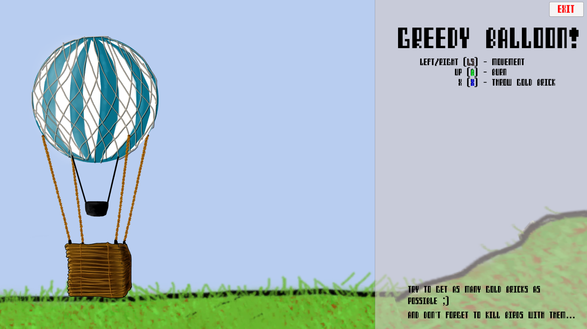
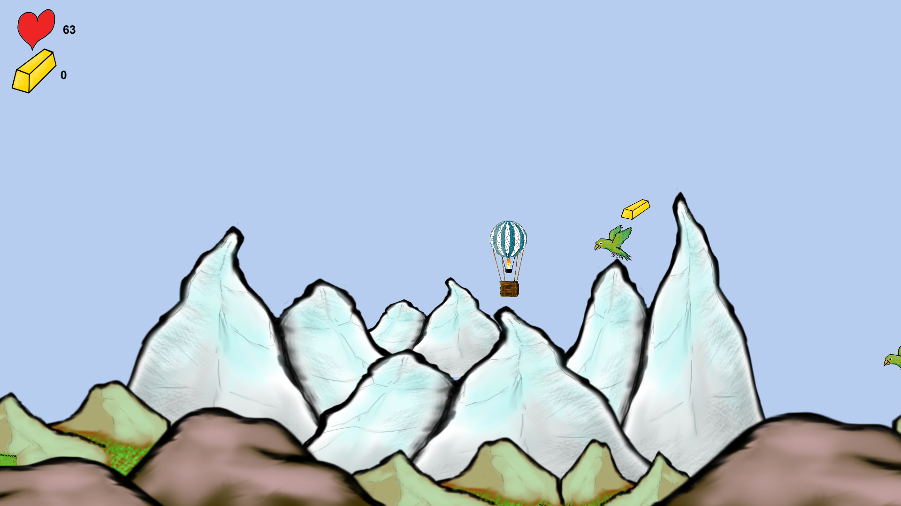

Greedy Balloon
=============

Game made for [40th Ludum Dare][1] game jam. Theme was **"The more you have, the worse it is"**. 

In this game you are a greedy hot air balloon travelling through mountains. You can pick there your favourite gold bars and carry them with you - but beware! They are gold bars and therefore heavy. You can encounter dangerous birds. Hopefully, you can kill them by throwing away your difficulty earned gold bars. Try to survive the path with as much gold bars as possible!

We made this game during 24 hours for Jam event. All assets were made by us. Only exception being the font [COMPUTER SPEAK][2]. Used technologies:

* **Unity3D**
* **GIMP** for graphics
* **bfxr** & **beepbox** for audio 

How to build the game
--------------------------------

Clone the repository and open folder *LD40* as Unity project. Everything necessary for build should be included.

How to play
----------------

Balloon can go sideways or it can burn fuel to go up. In addition to picking gold bricks, you can also throw them away to lower the weight. Game can be played on keyboard or with gamepad. Default controls are:

* **left/right (RS)** - horizontal movement
* **up (A)** - burn fuel
* **x (X)** - drop gold brick 

On splash screen press **up** to start the game.

[1]:https://ldjam.com/events/ludum-dare/40
[2]:https://fontlibrary.org/en/font/computer-speak
